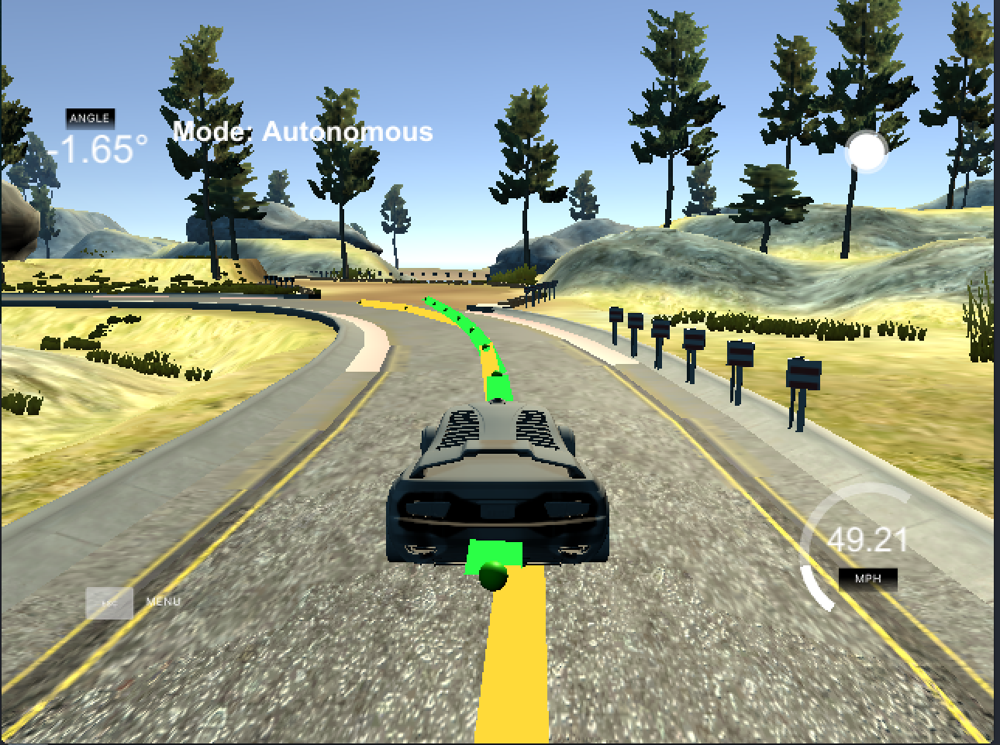

# Writeup - Model Predictive Control

This project was really interesting while also being challenging, since it was the project
that I was most thrown off the cliff with. I'll discuss rubric points here and go into
detail about my implementation.

I'm really grateful to my mentor Saurabh and the community for helping me iron out the last
few kinks in the project.

## The Model

The project's purpose is to steer and pedal (actuate) the car by finding the best possible
future trajectory for the car. We can do that by predicting the car's position multiple
"ticks" in the future, and finding how far off we will be from the trajectory. After prediction,
we predict a bunch more with different steering and pedal positions, and find a set of
actuations that gives us the closest prediction (green) to the waypoints (yellow).

Then the code allows an optimizer to take over, try a ton of combinations and return the one
that results in the best trajectory.

Lastly, we only use the first actuation and throw the rest away - this is to make sure we adapt
quickly to real world car position changes. It's safer to assume the car can't follow the entire
predicted trajectory to a tee.

## Timesteps

The car must be predicted over a series of timesteps. To do that, we have to pick the delay between
two timesteps and the amount of timesteps we use. I picked the values to make sure the total
predicted polynomial stays closer to the car than the last waypoint at 70 mph, and so that it provides
a decent amount of steps to predict.

A delta-time of **0.1s** between predictions is a safe bet since it matches real life conditions and causes
the least disruption to the actuations. Having a shorter time may make the model unstable, and having
a longer time will make the model imprecise.

Having tried a shorter time-delta, this is what happened - my controller made the car oscillate and
threw it off the track.

Using **10** timesteps means the last timestep will predict a second into the future, which is about the
amount of time we can safely predict a car. In real life, conditions change quickly and the car will
likely deviate from the used motion model.

Having tried with 20 timesteps, it makes the "horizon" go too far away, way past the waypoints. It also
adds unnecessary complexity to the solver.

## Preprocessing

Data from the simulator is in global coordinates, while it's easier for the optimizer to optimize around
the car's center as the coordinate origin. For that, I transform the car's coordinates to local coordinates
with a simple affine transform.

At the end of the transform, the car sits at X,Y 0,0 and with a psi angle of 0.

## Latency

In order to account for delays in the system, I also predict the car's position 100ms in the future,
using the same motion models as before. Since the car is at origin, the predictions reduce to very
short equations.

    x   = v * 0.1
    y   = 0
    psi = - v * (delta / Lf) * 0.1
    v   = v + (a * 0.1)
    cte = cte - (v * sin(eps) * 0.1)
    eps = eps - (v * (delta / Lf) * 0.1)

After solving the model, the predicted steering angle in degrees is converted into radians.

## Simulation criteria

The simulator car stays on the road for the entire lap, and doesn't oscillate. It slows down near
steeper curves.

[Video of it driving](https://youtu.be/Ktq3pD4UUy8)

[Video of it crashing in dev](https://youtu.be/3_bsoOeOyf4)

## Example run

Every tick, my program logs the error (CTE and Epsi), resulting cost and the actuations (steering
and throttle) that it performs. It additionally logs the amount of time the solver took to find
the perfect actuations, which is capped at 100 ms. If solving starts hitting the 100 ms mark, the
car can behave unpredictably since the solver won't always find the best path.

    cte -0.4319 eps -0.0082 steer -0.0073 throttle 0.4834 in 0012 ms
    Cost 519.878
    cte -0.3967 eps -0.0123 steer -0.0092 throttle 0.4816 in 0011 ms
    Cost 509.711
    cte -0.3517 eps -0.0153 steer -0.0109 throttle 0.4803 in 0013 ms
    Cost 498.695
    cte -0.3010 eps -0.0167 steer -0.0121 throttle 0.4831 in 0013 ms
    Cost 475.718
    cte -0.2408 eps -0.0162 steer -0.0128 throttle 0.4867 in 0009 ms
    Cost 434.126
    cte -0.1862 eps -0.0136 steer -0.0127 throttle 0.5049 in 0011 ms
    Cost 407.14
    cte -0.1547 eps -0.0190 steer -0.0126 throttle 0.5278 in 0011 ms
    Cost 326.78
    cte -0.1047 eps -0.0121 steer -0.0113 throttle 0.5289 in 0011 ms
    Cost 235.896
    cte -0.0730 eps -0.0037 steer -0.0091 throttle 0.5193 in 0009 ms
    Cost 172.833
    cte -0.0689 eps 0.0035 steer -0.0070 throttle 0.5102 in 0013 ms
    Cost 137.171
    cte -0.0843 eps 0.0098 steer -0.0048 throttle 0.5073 in 0012 ms
    Cost 134.926
    cte -0.1161 eps 0.0148 steer -0.0029 throttle 0.5091 in 0011 ms
    Cost 172.503